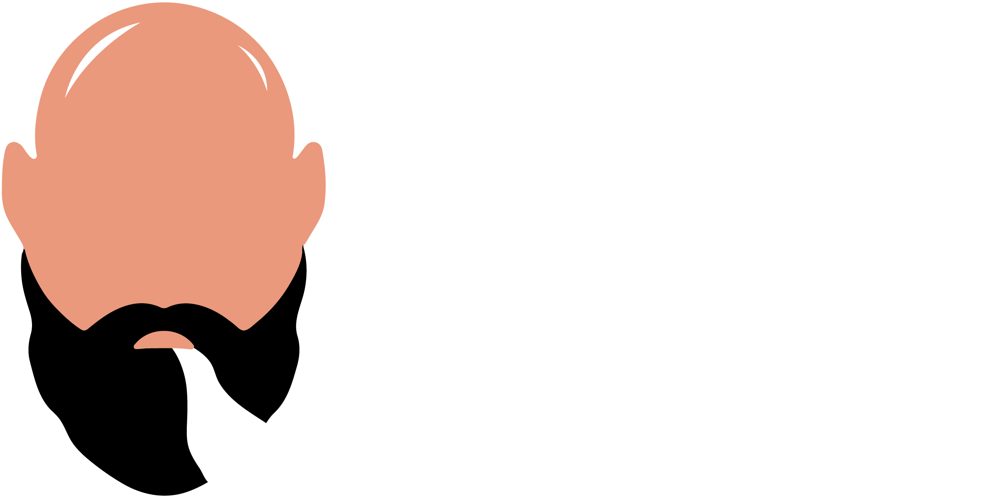

# Seja bem vindo(a) ao meu repositório de Back-end 👋

Este repositório conta com projetos do tipo biblioteca de classes para realização de integrações e tambem para centralizar funções de uso commum entre os projetos.

Também existe um projeto com desafios de código referente à plataforma Beecrowd (antigo URI Online Judge) e projetos criados utilizando diferentes arquiteturas como DDD e 3 camadas.

## Integrações

As pastas com prefixo Storm.Tecnologia são projetos de integrações com serviços de outras plataformas, sendo elas:

 + RD Station
 + Yahoo Finance
 + HCI Enviazap e 
 + Exact Spotter da Exact Sales.

## Bibliotecas

No projeto Storm.Tecnologia.Commom, existem funções e extensões de tipos de objeto para serem utilizados de forma geral em qualquer software.

## Projetos

### Variação do ativo

Trata-se de um projeto realizado para uma prova de recrutamento e seleção que pode ser encontrado no seguinte link:
https://github.com/guideti/variacao-ativo 

O projeto foi construído com .NET CORE 3.1 + Angular + SQL Server, utilizando a arquitetura DDD.

Para executar em sua máquina, será necessário abrir a solução com o Visual Studio 2022, e caso já não tenha, instalar os recursos necessários para a execução do Angular em sua máquina. Atente-se para alterar o arquivo `appsettings.json` para apontar para seu servidor do SQL Server e também o nome da Database desejada.

### Cadastro de Clientes

Trata-se de um projeto realizado para a startup DevLean.

O projeto foi construído com .Net Framework 4.8 e utiliza duas soluções do tipo Web Application para resolver o problema, sendo uma construída em MVC e outra com Web Forms. Todas as soluções foram construídas utilizando a arquitetura de 3 camadas (3 Layer Architecture).

Existem 2 projetos diferentes para consulta de dados, um utilizando EntityFramework e outro usando a biblioteca System.Data.SqlClient (ADO .NET) para consulta e manipulação dos dados.

Na pasta Scripts existe um script para criar o banco e as tabelas no SQL Server, necessários para a execução do projeto.

